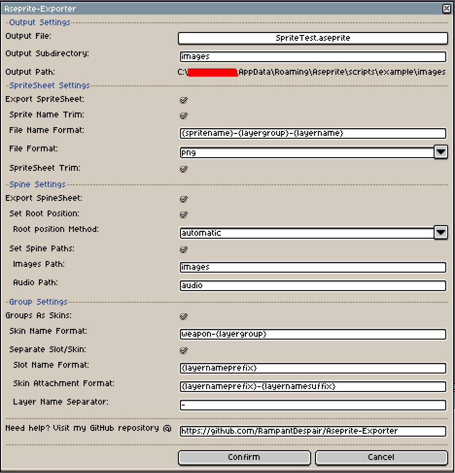

# Aseprite-Exporter

## Showcase

## Features
### Generic
- Configurable output path
- Configurable images & sound paths
- Ability to export Sprite sheet
- Ability to trim a Sprite's file name
- Ability to format the Sprite's file name
- Configurable export file format
- Ability to trim the Sprite sheet

### Spine
- Ability to convert SpriteSheet into importable Spine data
- Configurable root positioning
- Ability to convert Aseprite groups into Spine skins
- Ability to format slot and attachment names

## Example
### Transform this:

### Into that:

## Installation
1. Download the [latest-release](https://github.com/RampantDespair/Aseprite-Exporter/releases)
2. Open the Aseprite software
3. Go to **File > Scripts > Open Scripts Folder**
4. Copy the downloaded lua script to the scripts folder
5. Back in the Aseprite software, click **File > Scripts > Rescan Scripts Folder**

## Usage
1. Click **File > Scripts > Aseprite-Exporter**

## Important
- You cannot name your skins "default" as this is reserved by Spine itself

## Settings information
### Output Settings
| Option | Description | Default Value |
| --- | --- | --- |
| Output File | The parent directory of the selected file will be used for export. | the file itself |
| Output Subdirectory | The subdirectory used for export. | images |
| Output Path | The full path used for export. | Output File / Output Subdirectory |

### SpriteSheet Settings
| Option | Description | Default Value |
| --- | --- | --- |
| Export SpriteSheet | If the sprite sheet will be exported. | true |
| Sprite Name Trim | If the sprite name will be trimmed.  Trims the first instance "_" and everything preceding it. | true |
| File Name Format | The file name's format with modifiable placeholders. | {spritename}-{layergroup}-{layername} |
| File Format | The files' export format. | png |
| SpriteSheet Trim | If the exported files' will have there excess space trimmed. | true |

### Spine Settings
| Option | Description | Default Value |
| --- | --- | --- |
| Export SpineSheet | If the spine sheet will be exported. | true |
| Set Root Position | If the root position will be set in the export file. | true |
| Root Position Method | The method which will be used for setting the position.  Automatic: To use this method, create a layer called "root" and place a single pixel where you want the root to be.  Manual: Input the coordinates manually in the subsequent fields. | automatic |
| Root Position X | The X coordinate of the root. | 0 |
| Root Position Y | The Y coordinate of the root. | 0 |
| Set Spine Paths | If the paths whithin the exported spine file will be set. | true |
| Images Path | The images path. | images |
| Audio Path | The audio path. | audio |

### Group Settings
| Option | Description | Default Value |
| --- | --- | --- |
| Groups As Skins | If you want to convert aseprite groups to spine skins. | true |
| Skin Name Format | The skins' format with modifiable placeholders. | weapon-{layergroup} |
| Seperate Slot/Skin | If you want to seperate the slots and skins. | true |
| Slot Name Format | The slots' name format with modifiable placeholders. | {layernameprefix} |
| Skin Attachement Format | The skins' attachement format with modifiable placeholders. | {layernameprefix}-{layernamesuffix} |
| Layer Name Separator | The layers' name seperator. | - |

## Credits
Some portions of my code were inspired by the following repositories:
- [aseprite-to-spine](https://github.com/jordanbleu/aseprite-to-spine) made by [jordanbleu](https://github.com/jordanbleu)
- [AsepriteScripts](https://github.com/PKGaspi/AsepriteScripts) made by [PKGaspi](https://github.com/PKGaspi)
