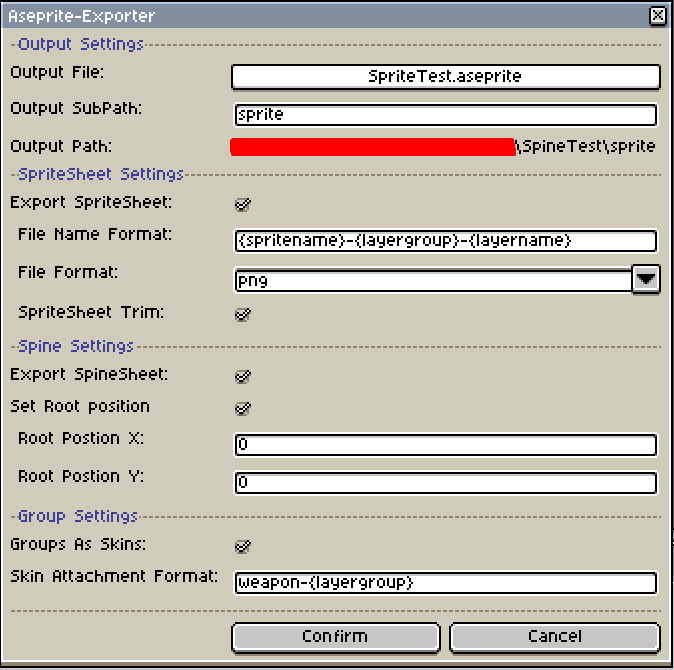

# Aseprite-Exporter
---
### Showcase

### Features
- Configurable output path & subpath
- Export layers using different naming patterns & settings
- Convert SpriteSheet into importable Spine data
- Configurable root positioning for Spine
- Convert Aseprite groups into Spine skins

### Example
**Transform this:**

**Into that:**

### Installation
1. Download the [latest-release](https://github.com/RampantDespair/Aseprite-Exporter/releases)
2. Open the Aseprite software
3. Go to **File > Scripts > Open Scripts Folder**
4. Copy the downloaded lua script to the scripts folder
5. Back in the Aseprite software, click **File > Scripts > Rescan Scripts Folder**

### Usage
1. Click **File > Scripts > Aseprite-Exporter**

### Important
- You cannot name your skins "default" as this is reserved by spine itself

### Credits
Some portions of my code were inspired by the following repositories:
- [aseprite-to-spine](https://github.com/jordanbleu/aseprite-to-spine) made by [jordanbleu](https://github.com/jordanbleu)
- [AsepriteScripts](https://github.com/PKGaspi/AsepriteScripts) made by [PKGaspi](https://github.com/PKGaspi)
