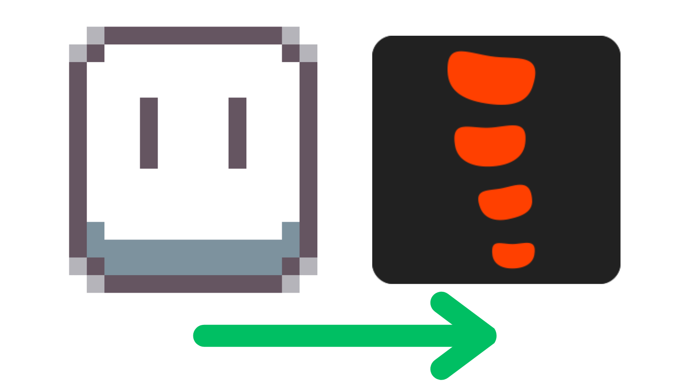
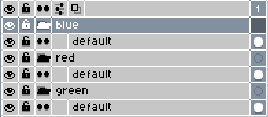
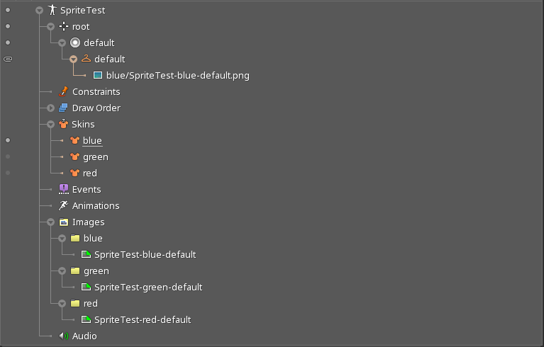

<!-- PROJECT LOGO -->

  
  <h2>Aseprite-Import-Export-Extension</h3>
  
An Aseprite extension that lets you mass-import images and export importable Spine data

  

    
    
  

  

<!-- PROJECT SHIELDS -->

  
  

  

<!-- PROJECT SHOWCASE -->

  

<!-- ABOUT THE PROJECT -->
## About The Project

This project was made to remove the hassle of exporting Aseprite files to Spine importable data.
 
With that in mind, this lua script lets you do so, with ease, and lets you export/import skins.

<!-- FEATURES -->
## Features

### Generic

*   Configurable output path
*   Configurable images & sound paths
*   Ability to export Sprite sheet
*   Ability to trim a Sprite's file name
*   Ability to format the Sprite's file name
*   Configurable export file format
*   Ability to trim the Sprite sheet

### Spine

*   Ability to convert SpriteSheet into importable Spine data
*   Configurable root positioning
*   Ability to convert Aseprite groups into Spine skins
*   Ability to format slot and attachment names

<!-- INSTALLATION -->
## Installation

1.  Download the [latest-release](https://github.com/RampantDespair/Aseprite-Import-Export-Extension/releases)
2.  Open the Aseprite software
3.  Go to **File > Scripts > Open Scripts Folder**
4.  Copy the downloaded lua script to the scripts folder
5.  Back in the Aseprite software, click **File > Scripts > Rescan Scripts Folder**

<!-- USAGE -->
## Usage

1.  Click **File > Scripts > Aseprite-Exporter**

<!-- EXAMPLE -->
## Example

### Transform this:

### Into that:

<!-- IMPORTANT -->
## Important

*   You cannot name your skins "default" as this is reserved by Spine itself

<!-- SETTINGS -->
## Settings information

### Config Settings

| Option | Description | Default Value |
| --- | --- | --- |
| Current Config | The current config file that's being used. | global |

### Output Settings

| Option | Description | Default Value |
| --- | --- | --- |
| Output File | The parent directory of the selected file will be used for export. | the file itself |
| Output Subdirectory | The subdirectory used for export. | images |
| Groups As Directories | If each group while be exported to it's own directory. | true |

### Sprite Settings

| Option | Description | Default Value |
| --- | --- | --- |
| Export SpriteSheet | If the sprite sheet will be exported. | true |
| Sprite Name Trim | If the sprite name will be trimmed.  Trims the first instance "_" and everything preceding it. | true |
| File Name Format | The file name's format with modifiable placeholders. | {spritename}-{layergroup}-{layername} |
| File Format | The files' export format. | png |
| SpriteSheet Trim | If the exported files' will have there excess space trimmed. | true |

### Spine Settings

| Option | Description | Default Value |
| --- | --- | --- |
| Export SpineSheet | If the spine sheet will be exported. | true |
| Set Static Slot | If the same slot will be used for everything that's exported. | true |
| Static Slot Name | The name of that static slot. | slot |
| Set Root Position | If the root position will be set in the export file. | true |
| Root Position Method | The method which will be used for setting the position.  <ins>Automatic</ins>: To use this method, create a layer called "root" and place a single pixel where you want the root to be.  <ins>Center</ins>: The center off the canvas will be used as root.  <ins>Manual</ins>: Input the coordinates manually in the subsequent fields. | center |
| Root Position X | The X coordinate of the root. | 0 |
| Root Position Y | The Y coordinate of the root. | 0 |
| Set Images Paths | If the images path whithin the exported spine file will be set. | true |
| Images Path | The images path. | images |
| Groups As Skins | If you want to convert aseprite groups to spine skins. | true |
| Skin Name Format | The skins' format with modifiable placeholders. | weapon-{layergroup} |
| Seperate Slot/Skin | If you want to seperate the slots and skins. | true |
| Slot Name Format | The slots' name format with modifiable placeholders. | {layernameprefix} |
| Skin Attachement Format | The skins' attachement format with modifiable placeholders. | {layernameprefix}-{layernamesuffix} |
| Layer Name Separator | The layers' name seperator. | - |

## Buttons Information

| Button | Description |
| --- | --- |
| Confirm | Confirms the settings for export. |
| Cancel | Cancels the export altogether. |
| Reset | Resets the settings to their default values. |

<!-- CONTRIBUTING -->
## Contributing

If you have a suggestion that would make this better, please fork the repo and create a pull request.
 
You can also simply open an issue with the tag "enhancement".
 
Any contributions you make are **greatly appreciated**.

<!-- LINKS -->
## Links

*   [Esoteric Software Forums](https://esotericsoftware.com/forum/d/24339-aseprite-spine-script) (Spine Animation Forums)

<!-- ACKNOWLEDGMENTS -->
## Acknowledgments

*   [aseprite-to-spine](https://github.com/jordanbleu/aseprite-to-spine) made by [jordanbleu](https://github.com/jordanbleu)
*   [AsepriteScripts](https://github.com/PKGaspi/AsepriteScripts) made by [PKGaspi](https://github.com/PKGaspi)
*   [Shields.io](https://shields.io/) for badges
